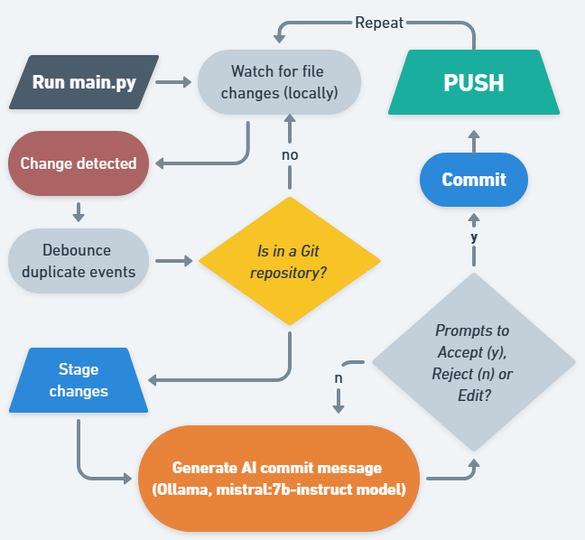

# Git Auto Commit & Push Automation


This project automates the process of **detecting file changes**, generating **AI-powered commit messages**, and **pushing changes to GitHub** across multiple repositories in a root folder.

## 🚀 Features:
- Watches for changes in all subfolders using `watchdog`
- Automatically stages, commits, and pushes changes
- AI-generated commit messages using `Ollama` and `mistral:7b-instruct` (runs locally)
- Supports multiple Git repositories under a single root path
- Debounces duplicate file events to avoid unnecessary commits

## 📂 Project Structure:
.<br>
├── main.py             # Watches for file changes and triggers automation<br>
├── git_automation.py   # Handles commit message generation and pushing<br>
├── .gitignore          # Ignores unnecessary files<br>
└── requirements.txt    # Python dependencies

## 🛠 Requirements:
- Python 3.9+
- Git installed and configured
- [Ollama](https://ollama.ai) installed and running
- **mistral:7b-instruct** model pulled and available locally in Ollama
- GitHub SSH or HTTPS authentication setup

## 🔧 Installation:
```bash
# Clone the project
git clone https://github.com/Rizwans-github/Git-automation
cd Git_automatoin

# Create a virtual environment
python -m venv venv
source venv/bin/activate    # Windows: venv\Scripts\activate

# Install dependencies:
pip install -r requirements.txt
```

## ⚙️ Configuration:
Edit `WATCH_PATH` in `main.py` to your Git root folder:
```python
WATCH_PATH = r"C:\Users\<username>\Tech\Github"
```

## ▶️ Usage:
```bash
# Start the watcher
python main.py
```

Whenever a file changes in any repository:
- Changes will be staged
- An AI commit message will be generated using `mistral:7b-instruct` locally
- Changes will be pushed to the current branch

## 🛑 Stopping the watcher:
Press `Ctrl + C` in the terminal.

## 📝 Example Commit Flow:
```bash
Change detected in: C:\Users\<username>\Tech\Github\MyRepo\script.py
AI Commit message: fix: resolve file watcher bug
Pushing changes to branch: main
✅ Changes committed and pushed successfully!
```

## 📌 Notes:
- Only staged and modified files are committed.
- Skips directories that are not Git repositories.
- `.git` folders and temporary files are ignored.
- Make sure `ollama` is running locally and `mistral:7b-instruct` model is available.

## 🤝 Contributing:
Contributions are welcome!  
If you would like to improve this project, please fork the repository and submit a pull request.

## 🛠 Future Improvements:
- Support for multiple AI models
- GitHub Actions integration
- Enhanced error logging
